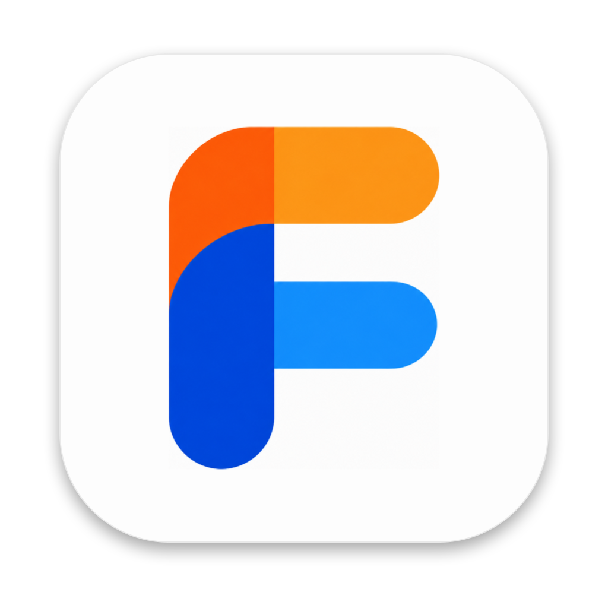

# Flione

**繁體中文** · [English](README.en.md)

Jellyfin 與 YouTube Music 的 macOS 原生音樂播放器。好好聽歌，也要好好蒐藏：用現代化的方式瀏覽，沉浸在音樂封面之中。

官網：<https://flione.rocavence.com>

<p align="center">
  
</p>

## 它在做什麼

Flione 連線到你自己的 Jellyfin 伺服器或 YouTube Music，把音樂庫變成三種平級的瀏覽方式，隨時用 ⌘1／⌘2／⌘3 或右上角切換：

- **Modern**：完整的音樂 app。首頁、音樂庫（專輯、藝人、歌曲、曲風、播放清單、最愛）、專輯與藝人頁、⌘K 搜尋、播放佇列與歌詞。專輯頁的背景帶上封面顏色的光暈，側欄半透明透出光暈。
- **Infinity**：整個音樂庫鋪成一面封面牆。可雙指縮放、游標離開時緩慢漂移，也可開啟「自動捲動」讓牆一直移動；Magic 排序可依顏色、曲風、年代或隨機重新排列。
- **Cover Flow**：橫向的封面展示台。點中間的封面翻面看曲目，背景光暈跟著中間的專輯變色。

### 播放

- 按下播放立刻有反應：畫面先進入播放狀態，背景再向伺服器取曲目，失敗或緩衝過久才提示
- 無縫換曲（AVQueuePlayer 預先緩衝下一首）、shuffle、Smart Shuffle（Jellyfin Instant Mix）、repeat
- 媒體鍵、控制中心 Now Playing、Dock 選單、選單列播放器、浮動迷你播放器
- 同步歌詞；伺服器沒有歌詞時可改查 LRCLIB（預設關閉）

### 音樂來源

- **Jellyfin**：自己的伺服器。無縫換曲、Smart Shuffle、曲風、編輯播放清單都只有 Jellyfin 支援
- **YouTube Music**：在 Flione 內開 Google 登入視窗登入；收藏的專輯、喜歡的歌曲、播放清單、播放記錄、搜尋都接到原本的三種模式。播放由隱藏的網頁播放器負責
- 登入畫面選擇來源；之後可在設定的「音樂來源」或側欄帳號選單切換。兩邊的登入都會保留，切換不用重新登入
- YouTube Music 使用的是非官方的 InnerTube API，Google 改版可能失效，也不能上架 App Store，詳見 [`docs/youtube/DESIGN.md`](docs/youtube/DESIGN.md)
- 重新開啟時恢復上次的播放佇列

### 外觀與語言

- 7 種配色：深海（預設）、寂靜、午夜、極光、翡翠、酒紅、冰川。三種模式與深淺色都套用；代表「正在播放」的橘色固定不變
- Modern 支援淺色與深色；Infinity 與 Cover Flow 固定深色，可各自調整封面圓角、漂移速度、光暈亮度等
- 介面支援繁體中文與英文，可在設定切換並記住；之後要加語言只需補上 String Catalog 的翻譯

## 為什麼是這個樣子

- **只連線到你選的音樂來源**：不需要 Flione 帳號，沒有分析，不追蹤。Jellyfin 的登入資訊存在鑰匙圈，YouTube Music 的登入是 app 內 WebKit 的 cookie。
- **原生**：SwiftUI 搭配 AppKit。封面牆與音樂庫格線用 `NSCollectionView` 重用 cell，1,400 張以上的專輯也能順暢捲動。
- **封面是主角**：顏色取自封面的 BlurHash，不需要額外下載圖片就能做光暈與 Magic 排序。

規格之外的設計取捨都記錄在 [`docs/DECISIONS.md`](docs/DECISIONS.md)。

## 安裝

從 [Releases](https://github.com/rocavence/Flione-app/releases/latest) 下載 `.dmg`（Apple 晶片的 Mac 選 `AppleSilicon`，Intel Mac 選 `Intel`），雙擊打開，把 Flione 拖進「應用程式」。這個版本沒有經過 Apple 公證，第一次打開前先打開「終端機」，執行：

```sh
xattr -dr com.apple.quarantine /Applications/Flione.app && open /Applications/Flione.app
```

### 從原始碼建置

需求：

- macOS 14 以上（Liquid Glass 效果需要 macOS 26）
- Xcode 26 以上
- [XcodeGen](https://github.com/yonaskolb/XcodeGen)：`brew install xcodegen`
- 一台 Jellyfin 伺服器（測試過 12.1），或一個 YouTube Music 帳號

```sh
xcodegen generate          # 由 project.yml 產生 Flione.xcodeproj
open Flione.xcodeproj      # 選 Flione scheme 執行
```

第一次啟動時在登入畫面選擇音樂來源。選 YouTube Music 會開 Google 的登入視窗（通行金鑰無法使用，請用密碼與兩步驟驗證）。選 Jellyfin 時，伺服器欄位可以只填主機名稱（例如 `mediabox`），Flione 會自動嘗試 `http://mediabox:8096`。

`Flione.xcodeproj` 不進版控；修改專案設定請改 `project.yml`。預設用 ad-hoc 簽章；想用自己的開發者憑證，在 `Config/` 建立 `Signing.local.xcconfig`（不進版控），寫上 `CODE_SIGN_IDENTITY` 與 `DEVELOPMENT_TEAM`，範例見 `Config/Signing.xcconfig`。

<details><summary>測試</summary>

```sh
xcodebuild -project Flione.xcodeproj -scheme Flione -destination 'platform=macOS' test
```

`RepositoryIntegrationTests` 會連真實伺服器。需要在 repo 根目錄建立 `.secrets/`（已排除在 git 之外）：

```text
.secrets/jellyfin.env   JELLYFIN_URL=、JELLYFIN_USER=、JELLYFIN_PASSWORD=
.secrets/session.env    JELLYFIN_TOKEN=、JELLYFIN_USER_ID=
```

沒有 `.secrets/` 時整合測試會自動略過。Debug 版與 `scripts/build-release.sh` 建出的測試版，啟動時若找得到 `.secrets/` 會直接登入。

</details>

<details><summary>專案結構</summary>

```text
Flione/
├── App/              進入點、AppEnvironment、選單與快捷鍵
├── Core/
│   ├── Jellyfin/     API client、DTO、MusicRepository
│   ├── YouTube/      InnerTube、YouTubeMusicRepository、網頁播放器、帳號
│   ├── Cache/        ImagePipeline（記憶體＋磁碟）、BlurHash
│   ├── Localization/ AppLanguage（介面語言）
│   ├── Persistence/  鑰匙圈、音樂庫快照、最愛、播放清單
│   └── Platform/     Now Playing、媒體鍵、鍵盤
├── DesignSystem/     色彩與配色、字級、間距、圓角、動態、陰影、Reicon
├── Components/       ArtworkView、按鈕、播放列、佇列與歌詞面板、Toast
├── Features/
│   ├── Onboarding/   登入、模式選擇
│   ├── Standard/     Modern：首頁、音樂庫、專輯、藝人、搜尋
│   ├── Overflow/     Infinity（封面牆）、Cover Flow、迷你播放器
│   ├── Lyrics/、MenuBar/、Settings/
├── Player/           PlayerManager（AVQueuePlayer）、PlayQueue
└── Resources/        Assets、Localizable.xcstrings（翻譯）
Spikes/               技術驗證程式（不隨 app 出貨）
scripts/              Reicon、app icon、測試版建置腳本
docs/                 規格、roadmap、決策紀錄、品牌、驗證報告
```

</details>

<details><summary>Icon 與翻譯</summary>

UI icon 一律使用 [Reicon](https://github.com/dqev/reicon)。新增 icon：

1. 在 `scripts/reicon/icons.txt` 加一行 Reicon 名稱
2. 執行 `python3 scripts/reicon/generate.py`
3. 在程式中使用 `FinifyIcon(.名稱)`

App icon 與選單列 icon 由 `scripts/icon/make-icon.swift` 依 macOS icon 格線產生。

介面文字的翻譯在 `Flione/Resources/Localizable.xcstrings`。新增語言：在 catalog 補上翻譯，再在 `Core/Localization/AppLanguage.swift` 加一個 case。

</details>

<details><summary>開發用啟動參數（DEBUG）</summary>

| 參數 | 作用 |
| ---- | ---- |
| `-FinifySecrets <資料夾>` | 從指定資料夾讀登入資訊；指向空資料夾會停在登入畫面 |
| `-FinifyStartMode standard\|overflow`、`-FinifyOverflowLayout Wall\|Flow` | 直接進入 Modern、Infinity 或 Cover Flow |
| `-FinifyMuted YES` | 播放音量 0，且不向 Jellyfin 回報播放 |
| `-FinifyDemoPlay "<專輯名>"`、`-FinifyDemoOpen "<專輯名>"` | 啟動後播放／打開該專輯 |
| `-FinifyDemoSearch "<關鍵字>"`、`-FinifyDemoSettings YES` | 啟動後打開搜尋／設定 |
| `-FinifyDemoTab library`、`-FinifyDemoSection <分頁>` | 直接打開音樂庫的指定分頁 |
| `-FinifyDemoSwitchTo coverFlow\|infinity\|modern` | 幾秒後切換模式（`-FinifyDemoSwitchAfter <秒>`） |
| `-FinifyDemoHoverAll YES` | Infinity 所有封面呈現 hover 狀態 |
| `-FinifyDemoFocusPlaying <秒>` | 幾秒後在 Infinity／Cover Flow 按「正在播放」 |
| `-FinifyDemoSeekToEnd <秒>` | 播放後跳到第一首結尾前 N 秒（驗證自動換曲） |
| `-FinifyLatencyProbe <輸出檔>` | 量測按下播放到畫面反應、取回曲目、出聲的時間 |
| `-AppleLanguages "(zh-Hant)"` | 以指定語言啟動 |

設定值也可以用啟動參數暫時覆寫，例如 `-FinifyTheme Dark`、`-FinifyColorTheme bordeaux`、`-FinifyFlowSettleDim 0.5`。

效能與穩定性量測（需以 `SWIFT_ACTIVE_COMPILATION_CONDITIONS=BENCHMARK` 建置 Release）：

| 參數 | 作用 |
| ---- | ---- |
| `-FinifyBenchWall <輸出.json>` | 自動捲動封面牆（加 `-FinifyBenchTarget library` 改量音樂庫格線），記錄掉 frame 與記憶體 |
| `-FinifyLaunchMark <輸出檔>` | 記錄啟動到視窗出現、首頁載入完成的時間 |
| `-FinifyGaplessProbe <輸出檔>` | 在 PlayerManager 上量測換曲停頓（搭配 `-FinifyDemoPlay`） |
| `-FinifySoak <輸出檔>` | 連續換曲 40 次並記錄記憶體 |

</details>

## 文件

- [`docs/FINIFY.md`](docs/FINIFY.md)：產品願景
- [`docs/EXECUTION-SPEC.md`](docs/EXECUTION-SPEC.md)：實作規格（衝突時以此為準）
- [`docs/ROADMAP.md`](docs/ROADMAP.md)：分期
- [`docs/DECISIONS.md`](docs/DECISIONS.md)：規格未定義處的決策與修改方式
- [`docs/brand/`](docs/brand/)：品牌故事與色彩系統
- [`docs/youtube/DESIGN.md`](docs/youtube/DESIGN.md)：YouTube Music 的設計與限制
- [`docs/spikes/`](docs/spikes/)：技術驗證結果

Flione 舊名 Finify；程式內部的型別前綴、bundle id、設定鍵與啟動參數仍沿用 Finify。
